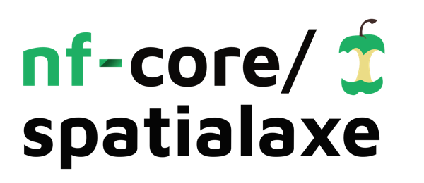

<h1>
  <picture>
    <source media="(prefers-color-scheme: dark)" srcset="docs/images/nf-core-spatialaxe_logo_dark.png">
    
  </picture>
</h1>

[](https://github.com/codespaces/new/nf-core/spatialaxe)
[](https://github.com/nf-core/spatialaxe/actions/workflows/nf-test.yml)
[](https://github.com/nf-core/spatialaxe/actions/workflows/linting.yml)[](https://nf-co.re/spatialaxe/results)[](https://doi.org/10.5281/zenodo.20733817)
[](https://www.nf-test.com)

[](https://www.nextflow.io/)
[](https://github.com/nf-core/tools/releases/tag/3.4.1)
[](https://www.docker.com/)
[](https://sylabs.io/docs/)
[](https://cloud.seqera.io/launch?pipeline=https://github.com/nf-core/spatialaxe)

[](https://nfcore.slack.com/channels/spatialaxe)[](https://bsky.app/profile/nf-co.re)[](https://mstdn.science/@nf_core)[](https://www.youtube.com/c/nf-core)

## Introduction

**nf-core/spatialaxe** is a bioinformatics best-practice processing and quality control pipeline for Xenium (and soon Atera) data. The current plan for the pipeline implementation is shown in the metromap below. **The pipeline is under active developement and changes might occure frequently**.


> [!NOTE]
> We are currently extending the pipeline for the [10x Atera system](https://www.10xgenomics.com/platforms/atera).

## Tools supported

The pipeline supports the following tools:

- Segmenation methods:
  - [Baysor](https://doi.org/10.1038/s41587-021-01044-w)
  - [Cellpose](https://doi.org/10.1038/s41592-020-01018-x)
  - [Xenium ranger (XR)](https://www.10xgenomics.com/support/software/xenium-ranger/latest)
  - [StarDist](https://doi.org/10.48550/arXiv.2203.02284)
- Segmentation free methods:
  - [Ficture](https://doi.org/10.1038/s41592-024-02415-2)
  - [Baysor](https://doi.org/10.1038/s41587-021-01044-w)
- Transcript assignment methods:
  - [Segger](https://doi.org/10.1101/2025.03.14.643160)
  - [Proseg](https://doi.org/10.1038/s41592-025-02697-0)
- Utility methods:
  - [SpatialData](https://doi.org/10.1038/s41592-024-02212-x)
  - [Baysor](https://doi.org/10.1038/s41587-021-01044-w)
- QC methods:
  - [MultiQC Xenium Extra Plugin](https://github.com/MultiQC/xenium-extra)
  - [OPT](https://github.com/JEFworks-Lab/off-target-probe-tracker)
  - [spoQC](https://github.com/heylf/spoQC)

## Usage

On release, automated continuous integration tests run the pipeline on a full-sized dataset on the AWS cloud infrastructure. This ensures that the pipeline runs on AWS, has sensible resource allocation defaults set to run on real-world datasets, and permits the persistent storage of results to benchmark between pipeline releases and other analysis sources. The results obtained from the full-sized test can be viewed on the [nf-core website](https://nf-co.re/spatialaxe/results).

> [!NOTE]
> The pipeline does not support conda currently. We are working on it.

## Quick Start

`samplesheet.csv`:

```csv
sample,bundle,image
test_sample,/path/to/xenium-bundle,/path/to/morphology.ome.tif
```

Now, you can run the pipeline using:

### Run image-based segmentation mode <br>

`CELLPOSE -> BAYSOR -> XR-IMPORT_SEGMENTATION -> SPATIALDATA -> QC`

```bash
nextflow run nf-core/spatialaxe \
   -profile <docker/singularity/.../institute> \
   --input samplesheet.csv \
   --outdir <OUTDIR> \
   --mode <MODE>
```

### Run coordinate-based segmentation mode <br>

`PROSEG -> PROSEG2BAYSOR -> XR-IMPORT_SEGMENTATION -> SPATIALDATA -> QC`

```bash
nextflow run nf-core/spatialaxe \
   -profile <docker/singularity/.../institute> \
   --input samplesheet.csv \
   --outdir <OUTDIR> \
   --mode coordinate
```

### Run segfree mode <br>

`BAYSOR_SEGFREE`

```bash
nextflow run nf-core/spatialaxe \
   -profile <docker/singularity/.../institute> \
   --input samplesheet.csv \
   --outdir <OUTDIR> \
   --mode segfree
```

### Run preview mode <br>

`BAYSOR_PREVIEW`

```bash
nextflow run nf-core/spatialaxe \
   -profile <docker/singularity/.../institute> \
   --input samplesheet.csv \
   --outdir <OUTDIR> \
   --mode preview
```

### Run just the quality control <br>

```bash
nextflow run nf-core/spatialaxe \
   -profile <docker/singularity/.../institute> \
   --input samplesheet.csv \
   --outdir <OUTDIR> \
   --mode qc
```

### Additional information

> [!WARNING]
> Please provide pipeline parameters via the CLI or Nextflow `-params-file` option. Custom config files including those provided by the `-c` Nextflow option can be used to provide any configuration _**except for parameters**_; see [docs](https://nf-co.re/docs/usage/getting_started/configuration#custom-configuration-files).

For more details and further functionality, please refer to the [usage documentation](https://nf-co.re/spatialaxe/usage) and the [parameter documentation](https://nf-co.re/spatialaxe/parameters).

## Pipeline output

To see the results of an example test run with a full size dataset refer to the [results](https://nf-co.re/spatialaxe/results) tab on the nf-core website pipeline page.
For more details about the output files and reports, please refer to the
[output documentation](https://nf-co.re/spatialaxe/output).

## Runtime and resource estimations

| Tool                      | Compute | Runtime (min / med / max) | Peak RSS (min / med / max) |
| ------------------------- | ------- | ------------------------- | -------------------------- |
| Cellpose                  | GPU     | 1m / 4m / 1.4h            | 10 GB / 26 GB / 554 GB     |
| Cellpose                  | CPU     | 1.3h / 2.3h / 6.5h        | 161 GB / 426 GB / 1115 GB  |
| StarDist                  | GPU     | 1m / 4m / 7m              | 5 GB / 12 GB / 18 GB       |
| StarDist                  | CPU     | 5m / 6m / 7m              | 18 GB / 18 GB / 18 GB      |
| Segger (create_dataset)   | GPU     | 2m / 9m / 31m             | 1.7 GB / 14 GB / 50 GB     |
| Segger (create_dataset)   | CPU     | 13m / 21m / 46m           | 13 GB / 19 GB / 49 GB      |
| Segger (train)            | GPU     | 10m / 43m / 2.9h          | 30 GB / 33 GB / 60 GB      |
| Segger (predict)          | GPU     | 2m / 16m / 59m            | 10 GB / 25 GB / 87 GB      |
| Baysor (whole-image)      | CPU     | 2m / 30m / 17h            | 6 GB / 10 GB / 650 GB      |
| Baysor (tiled)            | CPU     | 1m / 18m / 13h            | 0.2 GB / 34 GB / 530 GB    |
| Proseg                    | CPU     | 1m / 18m / 6.8h           | 279 MB / 3.8 GB / 136 GB   |
| XeniumRanger (resegment)  | CPU     | 18m / 39m / 3.7h          | 28 GB / 54 GB / 60 GB      |
| XeniumRanger (import_seg) | CPU     | 2m / 7m / 2.7h            | 2.6 GB / 11 GB / 51 GB     |
| Ficture (preprocess)      | CPU     | 3m / 4m / 13m             | 331 MB / 357 MB / 21 GB    |

- Cellpose GPU vs CPU: 35x faster on GPU (4m median vs 2.3h), 16x less memory (26 GB vs 426 GB)
- Segger: Only tool that truly requires GPU for all 3 steps (create_dataset, train, predict)
- StarDist: Very fast on CPU, GPU is not necessary to run its default model

## Credits

nf-core/spatialaxe is mainly developed by [Sameesh Kher](https://github.com/khersameesh24), [Dongze He](https://github.com/dongzehe), and [Florian Heyl](https://github.com/heylf).

We thank the following people for their extensive assistance in the development of this pipeline:

- Tobias Krause
- Krešimir Beštak (kbestak)
- Matthias Hörtenhuber (mashehu)
- Maxime Garcia (maxulysse)
- Kübra Narcı (kubranarci)

## Contributions and Support

If you would like to contribute to this pipeline, please see the [contributing guidelines](.github/CONTRIBUTING.md).

For further information or help, don't hesitate to get in touch on the [Slack `#spatialaxe` channel](https://nfcore.slack.com/channels/spatialaxe) (you can join with [this invite](https://nf-co.re/join/slack)).

## Citations

If you use nf-core/spatialaxe for your analysis, please cite it using the following doi: [10.5281/zenodo.20733817](https://doi.org/10.5281/zenodo.20733817)

An extensive list of references for the tools used by the pipeline can be found in the [`CITATIONS.md`](CITATIONS.md) file.

You can cite the `nf-core` publication as follows:

> **The nf-core framework for community-curated bioinformatics pipelines.**
>
> Philip Ewels, Alexander Peltzer, Sven Fillinger, Harshil Patel, Johannes Alneberg, Andreas Wilm, Maxime Ulysse Garcia, Paolo Di Tommaso & Sven Nahnsen.
>
> _Nat Biotechnol._ 2020 Feb 13. doi: [10.1038/s41587-020-0439-x](https://dx.doi.org/10.1038/s41587-020-0439-x).
